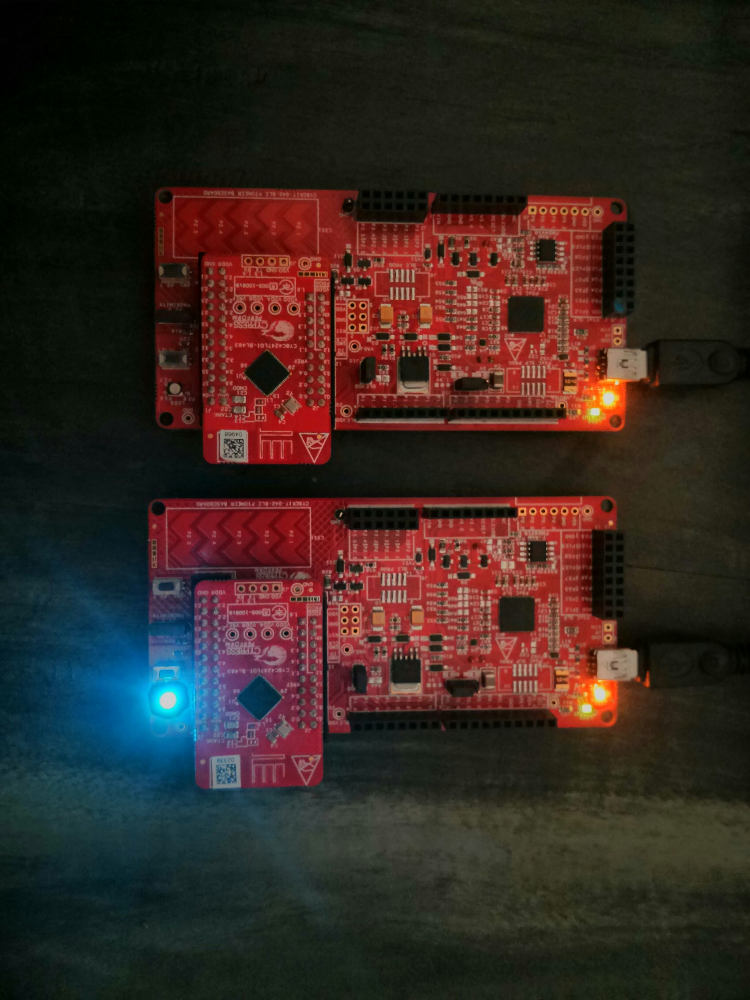

# BluetoothCommunication
This has code example for 1-way and 2-way bluetooth communication in PSoC

## Simple_1_Way_Communication
This folder has projects related to 1 way bluetooth communication between 2 PSoC BLE boards.
Server(Peripheral) communicates with Client(Central) with 3 bytes RGB data. Each time you press button in server, client RGB LED changes
 1. Bluetooth_Custom_Server
 This has PSoC project related to server.
 2. Bluetooth_Custom_Central
 This has PSoC project related to client. 
 
## Simple_2_Way_Communication
This folder has projects related to 2 way bluetooth communication between 2 PSoC BLE boards.
Server(Peripheral) communicates with Client(Central) with 3 bytes RGB data. Each time you press button in server, client RGB LED changes. Similarly,
Client(Central) communicates with Server(Peripheral) with 1 byte LED ON OFF data. Each time you press button in client, server LED light gets ON OFF.
 1. Bluetooth_Custom_Server
 This has PSoC project related to server
 2. Bluetooth_Custom_Central
 This has PSoC project related to client.
 
 ## Server's MAC address
 In both 1-way and 2-way communication, Client will only connect to the server. For this Servers MAC address has to be provided in clients code.
 To find the servers mac address. First program Server code to your PSoC BLE board. Then open your CySmart app in your phone.
 Server will be listed with the name as "Server BLE". Below that you will find the MAC address of that device. Like "A0 34 F1 89 23 12".
 Take this number and put it in your clients code. 
 
 ## Demo video of 2 way communication
 
